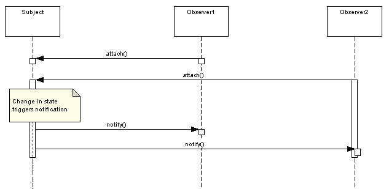
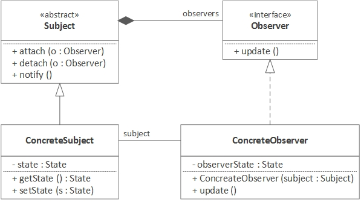

# Observable Pattern - Go

Observable is a very useful pattern where __subject__ maintains a list of __observers__ and notifies them of any state changes.

## Benefits
* __Loose Copuling__: enhances maintainability and flexibility. Changes in one component do not necessitate changes in others.

* __Scalability__: You can add or remove observers without impact the existing system. Crucial for growing applications.

* __Separation of Concerns__: Allow different partts of the application to focus on their  specific responsabilities without dependencies.

* __Automatic Notifications__: reduce manual checking and polling, improving performance and efficient resource usage.

* __Enhanced Redability and Maintenance__: Keep your code clear and organized, easier to develop understand and maintain the system over time.

## When to Use

* __Decoupling components__: when you watn decouple components, promoting flexible architecture

* __Asynchronous updates__: ideal for situations requiring asynchronous updates, where observables need to be notified of changes without blocking main execution flow.

* __Event Driven System__: where the state of one object (the subject) affects the state of others (the observers), such as in real-time data feeds or notificatin (Stock for example)

* __Dynamic Subscription__: useful when observers may need to subscribe or unsubscribe dynamically at runtime. Beneficial in scenarios where the number of observers is not fixed.

* __Multiple Observers__: a single events needs to notify multiple observers. Very common in GUI applications where user actions need to update various components simultaneously.

* __News Publishers and Subscriber__

* __Event Management systems where listeners act on events__

* __Model-View-Control (MVC) where the model notifies the view of changes__

## Diagram

Sequence diagram

Architecture